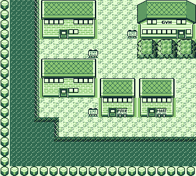
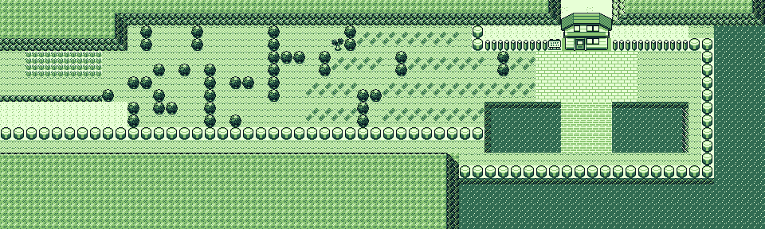
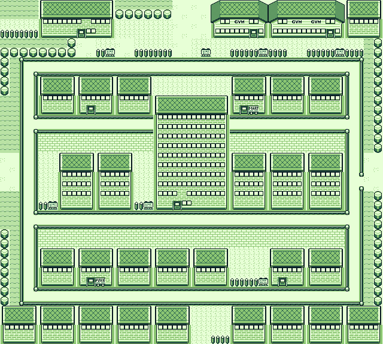

# Pokémon Crystal - Kanto Maps

A pokecrystal resource project designed to restore the Generation 1 Kanto maps for developers to use in their own Pokémon Crystal hacks.
The project preserves engine compatibility, carefully adjusting dimensions and object placements to ensure a clean structure, leaving developers the freedom to tweak and adapt the maps to their own preferences.

*Note: At the current state of the project, only the outdoor maps are mostly done. All of Kanto will eventually be available in the repository as development continues.

# Screenshots

Most of Cinnabar Island has been restored.
Boulders have been placed in front of the Cinnabar Gym entrance to preserve the original story progression, but they can easily be removed if you want the gym to be fully accessible.

Most of the Route 25 layout has been restored to match Generation 1.
However, a block of trees was placed near Bill's House to preserve the original scripted event where Misty is on a date, keeping it faithful to Crystal's storyline.
Developers are free to remove or alter this to fit their own vision.

The original Saffron City map has been restored, with the exception of the Magnet Train station to preserve Crystal's original placement.

# Credits

**Sylvie**
-Polished Map.

# Pokémon Crystal [![Build Status][ci-badge]][ci]

This is a disassembly of Pokémon Crystal.

It builds the following ROMs:

- Pokemon - Crystal Version (UE) (V1.0) [C][!].gbc `sha1: f4cd194bdee0d04ca4eac29e09b8e4e9d818c133`
- Pokemon - Crystal Version (UE) (V1.1) [C][!].gbc `sha1: f2f52230b536214ef7c9924f483392993e226cfb`
- Pokemon - Crystal Version (A) [C][!].gbc `sha1: a0fc810f1d4e124434f7be2c989ab5b5892ddf36`
- CRYSTAL_ps3_010328d.bin `sha1: c60d57a24bbe8ecf7cba54ab3f90669f97bd330d`
- CRYSTAL_ps3_us_revise_010710d.bin `sha1: 391ae86b1d5a26db712ffe6c28bbf2a1f804c3c4`
- CGBBYTE1.784.patch `sha1: a25517f60ca0e887d39ec698aa56a0040532a4b3`

To set up the repository, see [INSTALL.md](INSTALL.md).

## See also

- [**FAQ**](FAQ.md)
- [**Documentation**][docs]
- [**Wiki**][wiki] (includes [tutorials][tutorials])
- [**Symbols**][symbols]
- [**Tools**][tools]

You can find us on [Discord (pret, #pokecrystal)](https://discord.gg/d5dubZ3).

For other pret projects, see [pret.github.io](https://pret.github.io/).

[docs]: https://pret.github.io/pokecrystal/
[wiki]: https://github.com/pret/pokecrystal/wiki
[tutorials]: https://github.com/pret/pokecrystal/wiki/Tutorials
[symbols]: https://github.com/pret/pokecrystal/tree/symbols
[tools]: https://github.com/pret/gb-asm-tools
[ci]: https://github.com/pret/pokecrystal/actions
[ci-badge]: https://github.com/pret/pokecrystal/actions/workflows/main.yml/badge.svg
